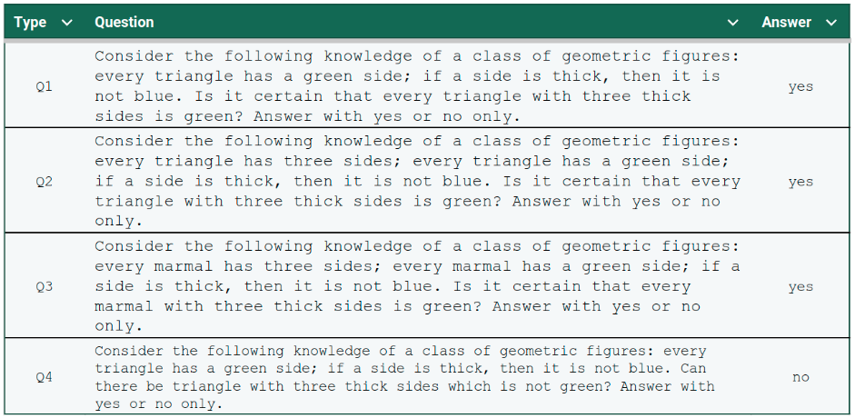

# Reasoning Capabilities and Invariability of Large Language Models

This repository contains the data for the paper titled *"Reasoning Capabilities and Invariability of Large Language Models"*.

The PDF of the paper will be available soon.

# Data  

This repository contains four files of questions, divided into two sets:  

- `questions_eni_dev.txt` (where `i=1,2,3,4`)  
  Contains six queries used for few-shot prompting, along with their corresponding answers.  

- `questions_eni_test.txt` (where `i=1,2,3,4`)  
  Contains the queries used for testing the reasoning capabilities of LLMs, along with their corresponding answers.  

The files are in a tab-separated format, with the first column containing the questions and the second column containing the labels.  

## Dataset Domain  
The dataset focuses on geometric figures and is framed as a binary classification task. It includes four types of questions, with each type containing 108 examples. These variations are carefully controlled as follows:  

1. **Base Logic Questions**  
   - These questions test logical reasoning about geometric figures.
2. **Questions with Added Common Sense Information**  
   - These questions provide additional specific details about the geometric figures to introduce common sense knowledge.
3. **Questions with Rephrased Terms**  
   - Builds on the second type by replacing standard geometric figure names (e.g., triangle, square) with invented terms (e.g., *marmal* and *wusp*).
4. **Negated Questions**  
   - Based on the first type, but the final question is negated, which flips the expected answer.  

## Examples  
Below is an example of each question type:  
  

# Citation

Please cite the following paper if you use the data in this repo.

```
@inproceedings{raganato-etal-2024-wi-iat,
  title={Reasoning Capabilities and Invariability of Large Language Models},
  author={Raganato, Alessandro and Pe{\~n}aloza, Rafael and Viviani, Marco and Pasi, Gabriella},
  booktitle={2024 IEEE International Conference on Web Intelligence and Intelligent Agent Technology (WI-IAT)},
  year={2024},
  organization={IEEE}
}
```
